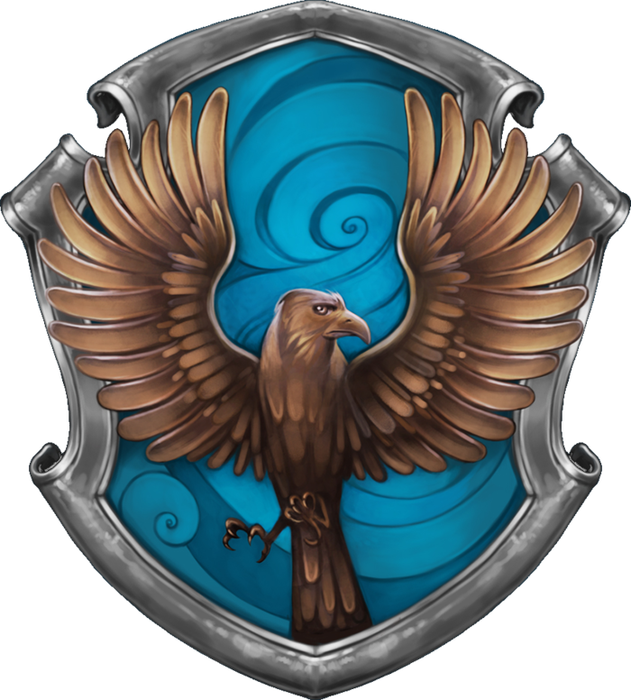

Lambda School Representing WEB23 - Ravenclaw

I'm sure I'll write a lot more interesting things in the future.

Oh, and here's a great quote from this Wikipedia on
[Ravemclaw](http://harrypotter.fandom.com/wiki/Ravenclaw).

> Ravenclaw is one of the four Houses of Hogwarts School of Witchcraft
> Its founder was the medieval witch Rowena Ravenclaw.
> The emblematic animal symbol is an eaglem and blue and bronze are its colours.
> The Head of Ravenclaw is Filius Flitwick and the house ghost is the Grey Lay,
> otherwise known as the daughter of Rowena Ravenclaw, Helena Ravenclaw.

